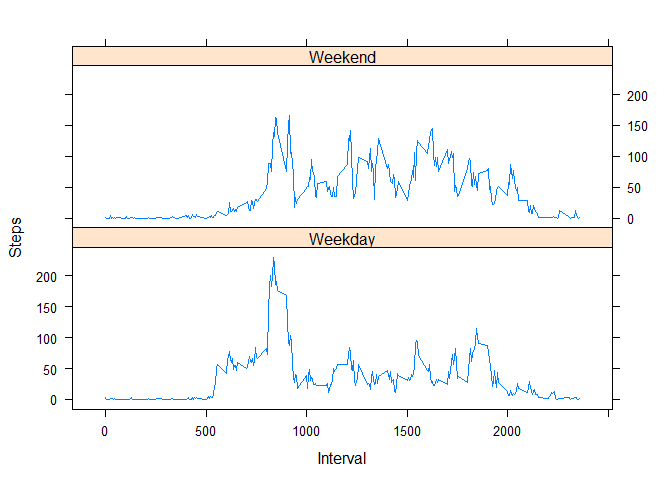

# Reproducible Research: Peer Assessment 1

First, we need to load some libraries, set some settings and unzip and read the dataset.


```r
library(dplyr)
library(lattice)
options(scipen=8) #scientific notation
Sys.setlocale("LC_TIME", "English") #so that it says "Monday" etc 
unzip("activity.zip")
steps_data = read.csv("activity.csv")
```

##Task 1: What is the total number of steps taken per day?


```r
steps_day <- group_by(steps_data,date)
sum_steps <- summarise(steps_day, sum(steps, na.rm = TRUE))
sum_steps[[2]] <- as.numeric(sum_steps[[2]])
hist(sum_steps[[2]], breaks = 10, col = "red", main = "Nr of steps per day", xlab = "")
```

 

```r
st_mean <- mean(sum_steps[[2]])
st_med <- median(sum_steps[[2]])
```

The mean number of steps taken per day is 9354.2295082, the median is 10395

##Task 2: What is the average daily activity pattern?

because we will need this multiple times, let's define a function to calculate the averages per interval and the maximum interval:


```r
calc_intervals <- function(d){
  steps_interval <- group_by(d,interval)
  mean_steps <- summarise(steps_interval, mean(steps, na.rm = TRUE))
  mean_steps[[2]] <- as.numeric(mean_steps[[2]])
  max_mean_steps_pos <- which.max(mean_steps[[2]])
  max_mean_steps <- mean_steps[[2]][max_mean_steps_pos]
  max_mean_steps_interval <- mean_steps[[1]][max_mean_steps_pos]
  return(list(mean_steps,max_mean_steps, max_mean_steps_interval))
}
```

Now, we will use this function


```r
result1 = calc_intervals(steps_data)
mean_steps = result1[[1]]
plot(mean_steps[[1]], mean_steps[[2]], type ="l", main ="Mean steps per interval", xlab = "Interval", ylab ="Steps")
```

 

The most active interval is 835 with an average of 206.1698113 steps.

##Task 3: Imputing missing values

Let's see how many rows have missing data

```r
NAs = nrow(steps_data[is.na(steps_data$steps),])
NA_means = nrow(steps_data[is.na(mean_steps[[2]]),])
```

2304 rows have missing data, and 0 averaged intervals have missing data. So we can substitute the missing values in the original data with the average of their interval.


```r
steps_data2 = steps_data # copy of the original data
for (i in 1:nrow(steps_data2)){ #for all rows...
  if (is.na(steps_data2[i,1])){     #if data is missing...
    interval <- steps_data2[i,3]        #what interval is it?
    steps_data2[i,1] <- mean_steps[mean_steps$interval == interval,2] #substitute NA with the mean from that interval
  }
}
```

Now let's calculate the values from above again


```r
steps_day2 <- group_by(steps_data2,date)
sum_steps2 <- summarise(steps_day2, sum(steps, na.rm = TRUE))
sum_steps2[[2]] <- as.numeric(sum_steps2[[2]])
hist(sum_steps2[[2]], breaks = 10, col = "red", main = "Nr of steps per day", xlab = "")
```

 

```r
st_mean2 <- mean(sum_steps2[[2]])
st_med2 <- median(sum_steps2[[2]])
```

Now, the mean number of steps taken per day is 10766.1886792 (a difference of 1411.959171), the median is 10766.1886792 (a difference of 371.1886792)

##Task 4: Are there differences in activity patterns between weekdays and weekends?

first, we find out if a given day is on a weekend or a weekday:

```r
steps_data2$dayname <- weekdays(strptime(steps_data2$date, "%Y-%m-%d"))
steps_data2$daytype <- lapply(steps_data2$dayname, 
              function(x){                   
                if (x %in% c("Saturday","Sunday")){
                  return("Weekend")
                  }
                else {
                  return("Weekday")
                  }
                })
```

Now, we split the data on the daytype and calculate the average number of steps individually and plot it:

```r
steps_data2_we <- steps_data2[steps_data2$daytype == "Weekend",]
steps_data2_wd <- steps_data2[steps_data2$daytype == "Weekday",]

result_we = calc_intervals(steps_data2_we)
mean_steps_we = result_we[[1]]
mean_steps_we$daytype = "Weekend"

result_wd = calc_intervals(steps_data2_wd)
mean_steps_wd = result_wd[[1]]
mean_steps_wd$daytype = "Weekday"

mean_steps2 = rbind(mean_steps_we, mean_steps_wd)
names(mean_steps2) <- c("Interval","Steps", "daytype")

xyplot(Steps ~ Interval| daytype , data = mean_steps2, layout = c(1,2), type="l")
```

 
